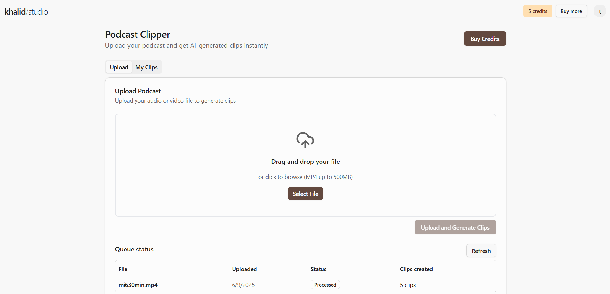
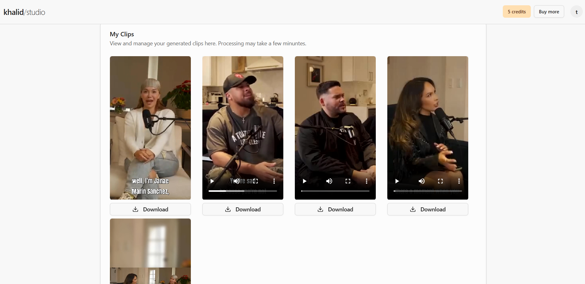
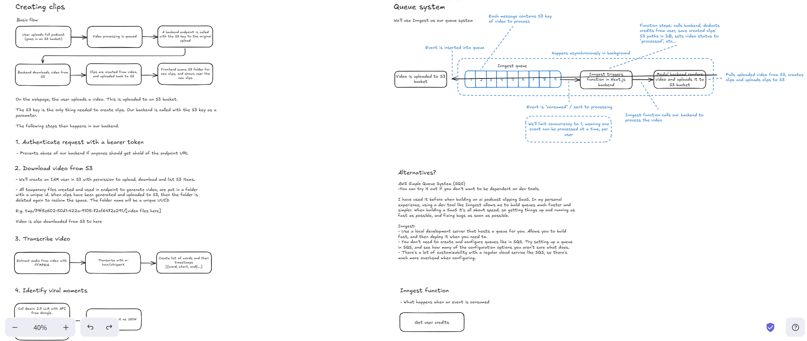
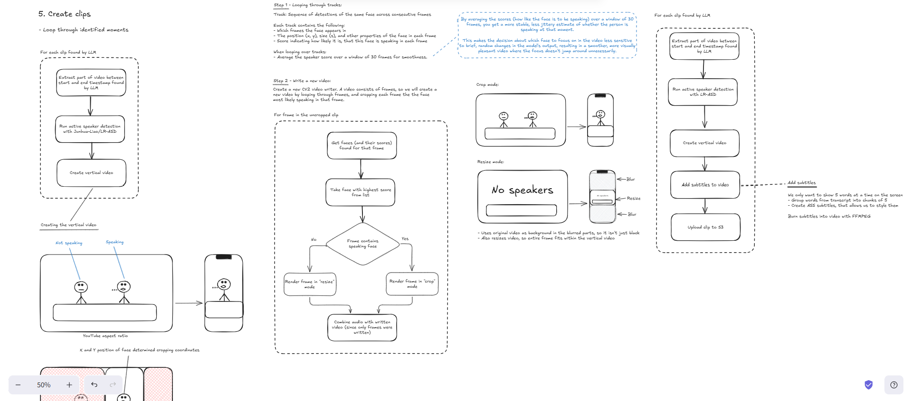
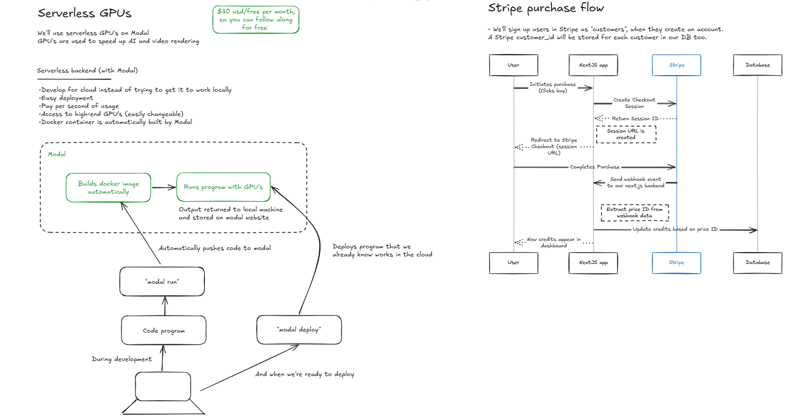
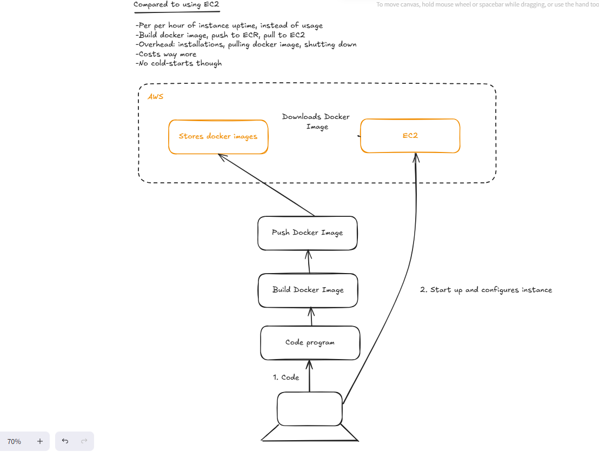

<div align="center">

# 🎙️ AI Podcast Clipper

**Upload full podcasts. Get short, viral clips ready to post — with subtitles, speaker cropping, and GPU-accelerated rendering.**

[]()
[]()
[]()
[]()
[]()
[]()
[]()
[]()

<br/>

**Deployed App:** [https://your-live-app-link.com](https://ai-podcast-clipper-frontend-kk.vercel.app/)  
<br/>

</div>

> **Note** — This project runs fully serverless with GPU processing on Modal and async background execution via Inngest.  
> Built to be scalable, cloud-native, and entirely free-tier friendly.

---

<div align="center">
  <!-- Replace these paths with your actual image paths -->
  
  
</div>

---

<details>
<summary>📜 Table of Contents</summary>

- [Overview](#overview)
- [Project Flow (Preview)](#-project-flow-preview)
  - [Clip Creation + Queue System](#-clip-creation--queue-system)
  - [Serverless GPU + Stripe Purchase Flow](#-serverless-gpu--stripe-purchase-flow)
- [Tech Stack](#-tech-stack)
- [Setup](#setup)
  - [Clone the Repository](#clone-the-repository)
  - [Install Python](#install-python)
  - [Backend](#backend)
  - [Frontend](#frontend)
  - [Queue](#queue)
- [AWS Setup](#aws-setup)
- [LLM for viral moment identification](#llm-for-viral-moment-identification)
- [Videos used for testing / thumbnail](#videos-used-for-testing--thumbnail)
- [Flow: How it Works](#-flow-how-it-works)
- [Credit System](#-credit-system)
- [Stripe Purchase Flow](#-stripe-purchase-flow)
- [Background Queue (Inngest)](#-background-queue-inngest)
- [Extra Notes](#-extra-notes)
- [Coming Soon](#-coming-soon)

</details>

---

## Overview

Hey 👋 this one's fun. It's a full-stack AI tool that turns long podcasts into short, clean, viral clips — fully automated. Upload a video and it does the rest: finds the good parts (like questions or stories), crops to the person talking, adds subtitles, and spits out vertical clips ready to post.

Built everything from scratch: AI models, background queues, credit/payments, auth, serverless GPU backend — all wired together into one smooth dashboard. Runs fully in the cloud and uses only free services, so anyone can try it without paying a cent.

Features

- 🧠 Detects viral moments using Gemini 2.5 (stories, questions, etc.)
- 📝 Transcribes full audio using WhisperX
- 🎯 Crops video to active speaker’s face with LR-ASD
- 🎞️ Renders vertical clips with GPU acceleration (OpenCV + FFmpeg)
- 🔊 Adds clean, styled subtitles automatically
- 📊 Runs all background processing through Inngest queues
- ⚡ Serverless GPU backend using Modal
- 💳 Credit-based system (1 credit = 1 clip)
- 💰 Stripe integration for credit pack purchases
- 👤 Auth.js-based user authentication
- 🎛️ Upload + clip dashboard built in Next.js 15
- 🎨 Responsive frontend styled with Tailwind CSS + Shadcn
- 🌐 FastAPI backend for processing and transcribing
- ☁️ Uses AWS S3 for video storage and clip output

## 📊 Project Flow (Preview)

Here's a quick preview of how everything connects under the hood — from video upload, clip generation, queue processing, to Stripe purchases and serverless GPUs.

> These diagrams helped me stay sane while wiring it all together.  
> Click to zoom in — or right-click > "Open in new tab" to see the full detail.

---

### Clip Creation + Queue System

<div align="center">
  
  
</div>

---

### Serverless GPU + Stripe Purchase Flow

<div align="center">
  
  
</div>

---

## 🔧 Tech Stack

| Layer      | Stack                                                   |
| ---------- | ------------------------------------------------------- |
| Frontend   | Next.js 15, React, Tailwind, ShadCN UI                  |
| Backend    | FastAPI (Python), Modal (serverless GPU runtime)        |
| AI & Video | WhisperX, Gemini 2.5, LR-RSD, FFmpeg, OpenCV            |
| Infra      | Modal, AWS S3, Inngest queue (async task orchestration) |
| Auth       | Custom Auth with email/password validation              |
| Payments   | Stripe Checkout + Webhooks                              |
| Storage    | S3 (Original videos + generated clips)                  |

---

## Setup

Follow these steps to install and set up the project.

### Clone the Repository

```bash
git clone --recurse-submodules https://github.com/khalidkarimkqr/AI-Podcast-Clipper-SaaS.git
```

### Install Python

Download and install Python if not already installed. Use the link below for guidance on installation:
[Python Download](https://www.python.org/downloads/)

Create a virtual environment with **Python 3.12**.

### Backend

Navigate to backend folder:

```bash
cd ai-podcast-clipper-backend
```

Install dependencies:

```bash
pip install -r requirements.txt
```

Clone the [LR-ASD](https://github.com/Junhua-Liao/LR-ASD) repo into the backend folder, and rename the folder asd:

```bash
git clone https://github.com/Junhua-Liao/LR-ASD.git
```

Modal setup:

```bash
modal setup
```

Run on Modal:

```bash
modal run main.py
```

Deploy backend:

```bash
modal deploy main.py
```

### Frontend

Install dependencies:

```bash
cd ai-podcast-clipper-frontend
npm i
```

Run:

```bash
npm run dev
```

### Queue

Run the local queue development server with Inngest:

```bash
cd ai-podcast-clipper-frontend
npm run inngest-dev
```

## AWS Setup

CORS policy for S3 bucket:

```bash
[
    {
        "AllowedHeaders": [
            "Content-Type",
            "Content-Length",
            "Authorization"
        ],
        "AllowedMethods": [
            "PUT"
        ],
        "AllowedOrigins": [
            "*"
        ],
        "ExposeHeaders": [
            "ETag"
        ],
        "MaxAgeSeconds": 3600
    }
]
```

IAM user policy to upload, download and list bucket items:

```bash
{
    "Version": "2012-10-17",
    "Statement": [
        {
            "Effect": "Allow",
            "Action": [
                "s3:ListBucket"
            ],
            "Resource": "[S3 ARN here]"
        },
        {
            "Effect": "Allow",
            "Action": [
                "s3:GetObject",
                "s3:PutObject"
            ],
            "Resource": "[S3 ARN here]/*"
        }
    ]
}
```

---

## LLM for viral moment identification

[Create an API key for Gemini](https://ai.google.dev/gemini-api/docs/quickstart?lang=python)

# Videos used for testing / thumbnail

[MI6 Secret Agent Talks About the World's Darkest Secrets](https://www.youtube.com/watch?v=-vMgbJ6WqN4)

[Janney Sanchez | Therapy saved my life, From Rivera to Sanchez , Living in my Moms Shadow | Ep.198](https://www.youtube.com/watch?v=SOG0GmKts_I)

---

## 🧵 Flow: How it Works

### 1. Upload

- User uploads a podcast via frontend.
- Video is stored in **S3 bucket**.
- A message with the S3 key is added to an **Inngest queue**.

### 2. Queue triggers backend processing

- A **FastAPI endpoint** (hosted on Modal with GPUs) is triggered.
- Video is downloaded from S3 to a temp folder.

### 3. Transcription

- **FFmpeg** extracts audio.
- **WhisperX** transcribes the audio and outputs word-level timestamps.

### 4. Viral Moment Detection

- Full transcript + timestamps are sent to **Gemini 2.5**.
- Output: JSON list of "viral" segments (under 60 seconds).

### 5. Speaker-aware Cropping

- For each viral moment:
  - Video is sliced using start-end timestamps.
  - **LR-RSD** detects speaker face positions across frames.
  - Each frame is cropped around the speaker's face.
  - If no face is found → fallback to blurred-resize mode.

### 6. Subtitle Rendering

- Every 5 words = 1 subtitle chunk.
- Subtitles styled using ASS format.
- **FFmpeg** burns subtitles into the final video.

### 7. Output

- Final vertical clip (1080x1920) is rendered.
- Clip is uploaded to the same S3 folder.
- Clip paths are saved to DB.
- Frontend polls the folder and displays ready-to-download clips.

---

## 💰 Credit System

- Every user starts with **10 free credits**.
- Each clip = 1 credit.
- Buy more credits via **Stripe** (3 packs: 50, 100, 150).
- Stripe Webhooks auto-update user credit balance on success.

---

## 🧾 Stripe Purchase Flow

1. User clicks "Buy credits" → redirected to Stripe Checkout.
2. Purchase completes → Stripe sends webhook.
3. Backend receives webhook, updates user's credits based on pack.
4. Dashboard reflects updated credits in real-time.

---

## 🔄 Background Queue (Inngest)

- Manages concurrency (1 video per user at a time)
- Decouples upload from processing
- Each step tracked: uploading, processing, credits deducted, finished
- Retries failed steps independently
- Can scale dynamically

---

## ✅ Extra Notes

- Cold start on Modal ≈ 3s — not a big deal since everything runs in the background
- You can replace Inngest with AWS SQS (but dev flow is slower)
- You get $30/month free compute on Modal (enough to test this out)

---

## 🚀 Coming Soon

- User analytics dashboard
- Drag to trim clip editor
- Clip export presets (1080p, 720p, etc.)
- Optional monthly credit subscriptions

---
